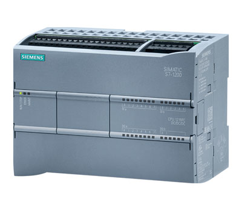
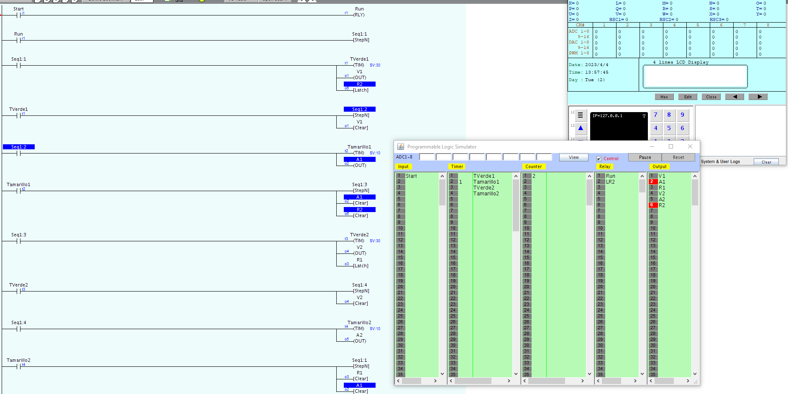
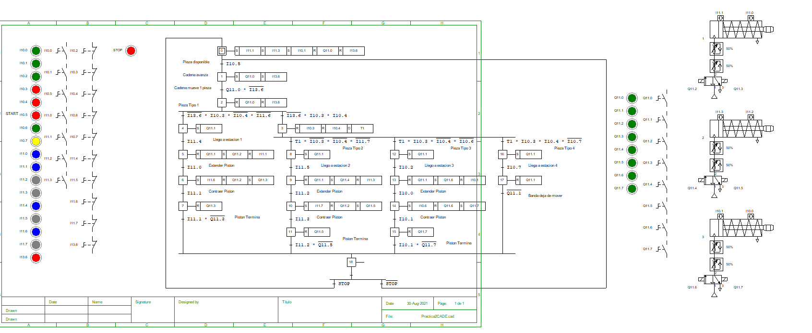
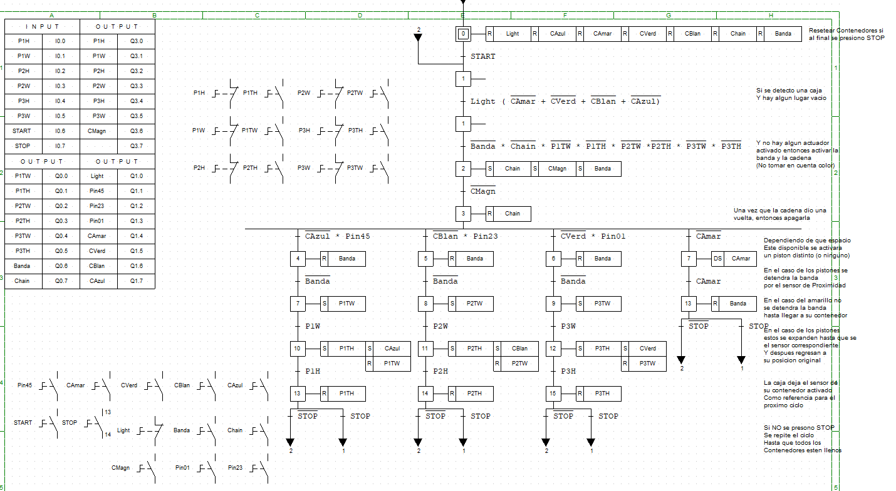
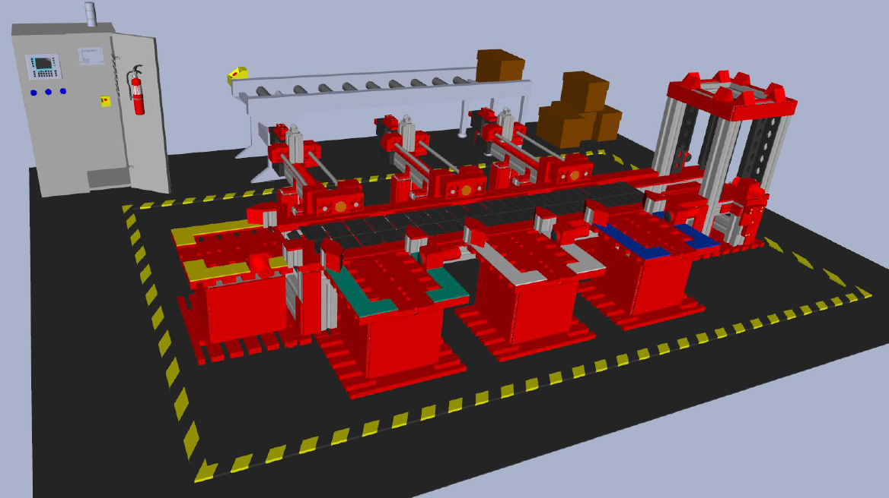

<br />
<div align="center">
	<a href="https://github.com/DarioArzaba/PLCProgramming">
		
	</a>
	<h3 align="center">PLC Programming</h3>
	<p align="center">
    	PLC Programming (automation) projects done in a variety of educational and professional software.
  	</p>
</div>

## Installation

1. Clone the repo (Around 200MB as of 2023)
   ```sh
   git clone https://github.com/DarioArzaba/PLCProgramming.git
   cd PLCProgramming
   ```

***

<details><summary> GAL Programming </summary><p>

1. Download and install Microchip [WinCUPLE](https://www.microchip.com/en-us/products/fpgas-and-plds/spld-cplds/pld-design-resources) to edit the `PLD` files and then compile them into `jed` files that can be burned directly into the intended chip with an external GAL programmer.

</p></details>

***

<details><summary> CADe-SIMU </summary><p>

1. Download and install the freeware ladder PLC simulator [CADe-SIMU](https://cade-simu.com/).
2. Open, edit and run `CAD` files, notice that they can represent electric, hydraulic and pneumatic systems.

</p></details>

***

<details><summary> i-TRiLOGI </summary><p>

1. Buy or use the trial version of the PLC programming environment [i-TRiLOGI 7](https://triplc.com/trilogi.htm).
2. Open, edit and run `PC7` files using Ladder Programming and the monitor to see the state of different variables.

</p></details>

***

<details><summary> LogixPro 500 </summary><p>

1. Buy or use the trial version of the Rockwell PLC programming environment [LogixPro 500](https://canadu.com/lp/logixpro.html).
2. Open, edit and run `rsl` files using Ladder Programming and sprites to simulate real world objects like assembly lines.

</p></details>

***

<details><summary> ZelioSoft 2 </summary><p>

1. Buy or use the trial version of the Schneider Electric PLC programming environment [ZelioSoft 2](https://www.se.com/mx/es/product-range/542-zelio-soft/#overview).
2. Open, edit and run `zm2` files using Ladder Programming and GUI to make connections and submodules.

</p></details>

***

<details><summary> SIEMENS TIA PORTAL </summary><p>

1. Buy or use the trial version of the Siemens Automation Solution [TIA Portal Software](https://new.siemens.com/global/en/products/automation/industry-software/automation-software/tia-portal/software.html).
	1. Trial version TIA PORTAL 16 (TIA PORTAL STEP7 WINCC ADV UNIFIED INSTALLER) [PART 1](https://drive.google.com/file/d/18ytwLEbslcc10obI-La93fgYgP4DMWKz/view?usp=sharing), [PART 2](https://drive.google.com/file/d/102qHGzVMbuGPuNtX7vUx3Zg1Nwe4srvr/view?usp=sharing), [PART 3](https://drive.google.com/file/d/1HoQhK2B_f6AzfUZ9NdEuhL0xGQH-SDbQ/view?usp=sharing), [PART 4](https://drive.google.com/file/d/1S1mhspNTz4I6oEJfvDClaC0m2LxsKNxY/view?usp=sharing)
	2. PLC 300 and 400 Simulation ([S7 PLCSIM V5.4.8.1](https://drive.google.com/file/d/1dM8inmK2gIu9hAprcRDO8lwsqpdI6369/view?usp=sharing))
	3. PLC 1200 and 1500 Advanced Simulation ([S7PLCSIM ADVANCED](https://drive.google.com/file/d/1-fyJaWZpTp6dcJYvOfENG7rtDdVEBtBM/view?usp=sharing))
	4. [LABVIEW RUNTIME 2018](https://www.ni.com/en-us/support/downloads/software-products/download.labview-runtime.html).
	5. SIMATIC WINCC (WinPcap4.1.3) [WinCap](https://drive.google.com/file/d/1ag44mJoMXxedgemsiNo7H3br0UFMWhP-/view?usp=sharing)
	6. DOTNET Fx 35 ([Dot Net](https://drive.google.com/file/d/1T12oSLjELe5x6MPgY3eJsKiuILepIpbC/view?usp=sharing))
	7. For SIM 5.4 and SIM ADV: Virtual Machines [PART 1](https://drive.google.com/file/d/1rj-joAVCbb40hy0RKLZCgn8ArQ9QdYGc/view?usp=sharing), [PART 2](https://drive.google.com/file/d/1ap2CVj5m266eergqXYhCl3nucicWuyso/view?usp=sharing)
	8. Copy (HmiRTm.ini) Multiple [Human Machine Interface file](https://drive.google.com/file/d/1f6F6jlU9Xk_RV5hrkKWnDjlVZN-XWhEf/view?usp=sharing) in WINCCRT ADVANCED folder.
2. Open, edit and run `ap16` project files using using any automation programming language (Ladder, Structured Text, etc.) and create interactive Human Machine Interfaces.

</p></details>

***

</br>
<div align="center"> <p> Example of i-TRiLOGI Ladder </p> </div>

</br>
<div align="center"> <p> Example of CADe-SIMU pneumatic system </p> </div>

</br>
<div align="center"> <p> Example of CADe-SIMU state machine </p> </div>

</br>
<div align="center"> <p> TIA Portal Processing Line (Automatic Sorting Line) </p> </div>


## License

Distributed under the [MIT License](https://mit-license.org/).

## Contact

Dario Arzaba - dario.arzaba@gmail.com